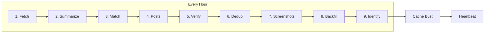
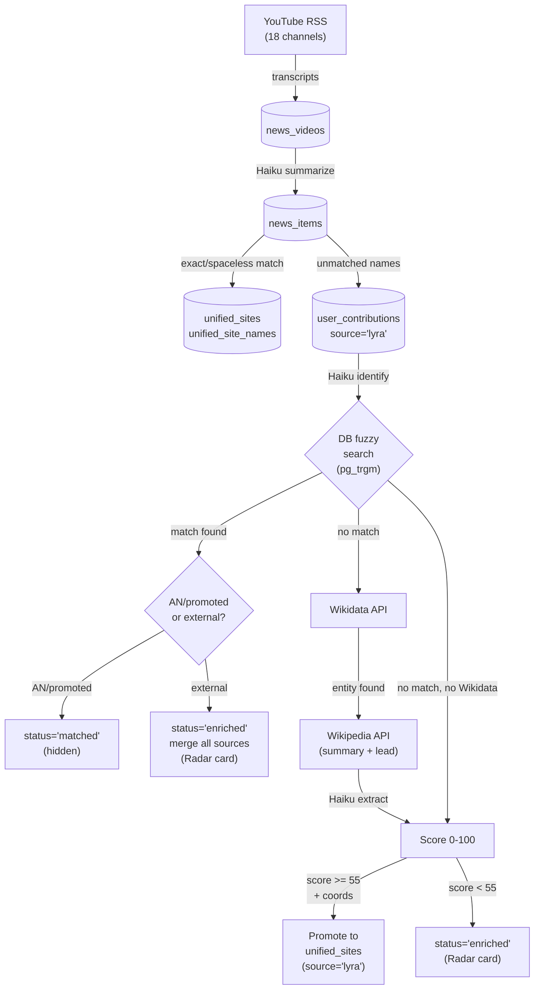
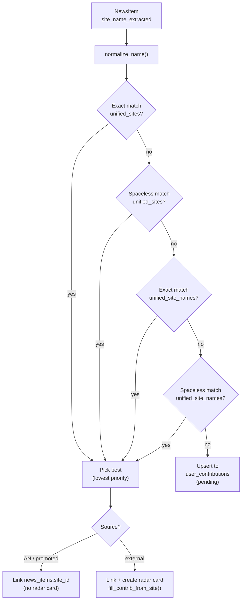
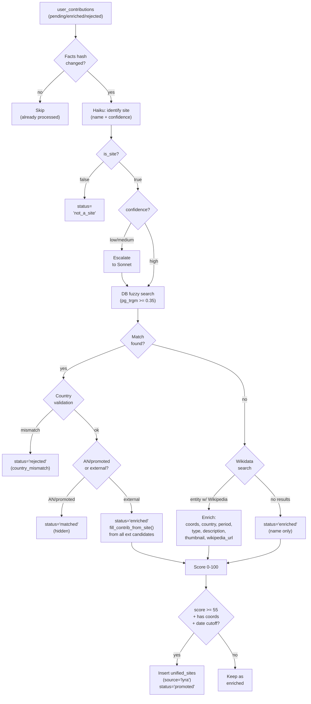
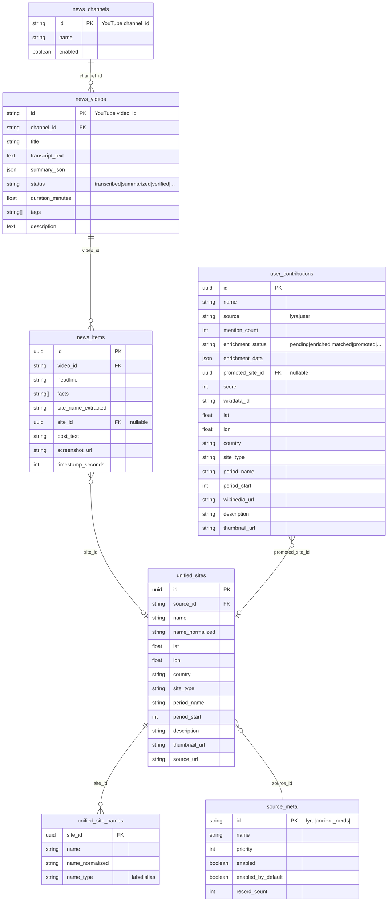
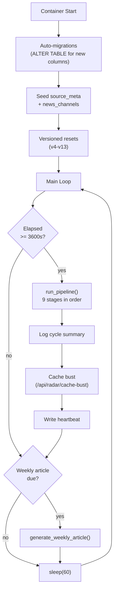

# Lyra News Pipeline

Fully-automated AI-powered archaeological news discovery system. Runs on a 1-hour cycle inside the `ancient_nerds_api` Docker container. Transforms raw YouTube video content into curated Radar cards through 9 sequential stages.

---

## Pipeline Overview



| Stage | File | Entry Point | AI Model |
|-------|------|-------------|----------|
| 1. Fetch | `transcript_fetcher.py` | `fetch_new_videos()` | - |
| 2. Summarize | `summarizer.py` | `summarize_pending_videos()` | Haiku |
| 3. Match | `site_matcher.py` | `match_sites_for_pending_items()` | - |
| 4. Posts | `tweet_generator.py` | `generate_pending_posts()` | Sonnet |
| 5. Verify | `tweet_verifier.py` | `verify_pending_posts()` | Haiku |
| 6. Dedup | `tweet_deduplicator.py` | `deduplicate_posts()` | - |
| 7. Screenshots | `screenshot_extractor.py` | `extract_screenshots()` | - |
| 8. Backfill | `transcript_fetcher.py` | `backfill_video_descriptions()` | - |
| 9. Identify | `site_identifier.py` | `identify_and_enrich_sites()` | Haiku + Sonnet |

---

## Data Flow



---

## Stage Details

### 1. Fetch (`transcript_fetcher.py`)

Fetches recent videos from 18 seed YouTube archaeology channels via RSS. Downloads transcripts (youtube-transcript-api, optional Webshare proxy) and metadata (yt-dlp). Skips videos < 5 minutes.

- **Reads:** `news_channels` (enabled only)
- **Writes:** `news_videos` (status=`transcribed` or `failed`)
- **External:** YouTube RSS, youtube-transcript-api, yt-dlp

### 2. Summarize (`summarizer.py`)

Sends full transcript to Haiku. Extracts 2-8 key archaeological topics per video (scaled by duration + queue size). Queue soft cap 32 / hard cap 48.

- **Reads:** `news_videos` (status=`transcribed`)
- **Writes:** `news_items` (headline, facts[], site_name_extracted), `news_videos.summary_json`
- **Model:** Haiku (`prompts/summary.txt`)

### 3. Match (`site_matcher.py`)

Matches `news_items.site_name_extracted` against the curated sites database. Four strategies in order: exact name, spaceless name, exact alt-name, spaceless alt-name. Multiple candidates resolved by source priority.



- **Reads:** `unified_sites`, `unified_site_names`, `news_videos.summary_json`
- **Writes:** `user_contributions` (upsert by lowercase name), `news_items.site_id`
- **Key function:** `fill_contrib_from_site()` -- canonical 10-field fill-if-missing

### 4. Posts (`tweet_generator.py`)

Generates short-form social posts (280 chars) from news items via Sonnet. One post per item. Includes timestamp attribution and recency note.

- **Reads:** `news_items`, `news_videos.summary_json`
- **Writes:** `news_items.post_text`
- **Model:** Sonnet (`prompts/tweet_template.txt`)

### 5. Verify (`tweet_verifier.py`)

Fact-checks posts against the transcript segment around the timestamp (+/-10s). Verdict: ACCEPT / MODIFY / REJECT.

- **Reads:** `news_items.post_text`, `news_videos.transcript_text`
- **Writes:** `news_items.post_text` (modifications), `news_items.timestamp_seconds` (refinements)
- **Deletes:** rejected items
- **Model:** Haiku (`prompts/verify_tweets.txt`)

### 6. Dedup (`tweet_deduplicator.py`)

Removes semantic duplicates. Feature extraction: numbers, words > 3 chars, URLs, timestamps. Weighted similarity: 40% numbers + 40% words + 20% metadata. Threshold: 0.25. Keeps newest.

- **Reads/Deletes:** `news_items` (with post_text)

### 7. Screenshots (`screenshot_extractor.py`)

Extracts one frame per news item at the post timestamp. Two-step: yt-dlp downloads 3s clip, ffmpeg extracts WebP frame (300px, q75). 4 parallel workers, 3 retries with proxy rotation.

- **Reads:** `news_items.timestamp_seconds`
- **Writes:** `news_items.screenshot_url` -> `public/data/news/screenshots/{video_id}_{ts}.webp`
- **External:** yt-dlp (with proxy), ffmpeg

### 8. Backfill (`transcript_fetcher.py`)

Fills in missing video metadata (description, tags) for older videos via yt-dlp.

- **Reads/Writes:** `news_videos.description`, `news_videos.tags`

### 9. Identify + Enrich (`site_identifier.py`)

The core AI discovery engine. Processes up to 20 candidates per cycle.



**Scoring breakdown:**

| Field | Points |
|-------|--------|
| Site name confirmed | 25 |
| Coordinates (lat/lon) | 20 |
| Country | 10 |
| Site type | 10 |
| Period / dating | 10 |
| Description (>= 50 chars) | 10 |
| Wikipedia URL | 5 |
| Thumbnail | 5 |
| Wikidata ID | 5 |
| **Max** | **100** |

Promotion threshold: **55** (requires coords + passes date cutoff).

---

## Database Tables



---

## Status Codes

### `news_videos.status`

| Status | Meaning | Next Stage |
|--------|---------|------------|
| `transcribed` | Has transcript | Summarize |
| `failed` | No transcript available | - |
| `skipped` | Too short (< 5 min) | - |
| `summarized` | summary_json populated | Posts |
| `posted` | Posts generated | Verify |
| `verified` | Posts fact-checked | Dedup/Screenshots |

### `user_contributions.enrichment_status`

| Status | Meaning | Visible on Radar? |
|--------|---------|:-:|
| `pending` | Awaiting identification | No |
| `enriching` | Currently processing (transient) | No |
| `enriched` | Identified + scored | Yes |
| `matched` | Matched to AN Original / promoted site | No |
| `rejected` | Country mismatch or other rejection | No |
| `promoted` | Promoted to `unified_sites` | Yes (as globe dot) |
| `failed` | Processing error | No |
| `not_a_site` | AI determined not an archaeological site | No |

---

## External APIs

| API | Used By | Purpose |
|-----|---------|---------|
| YouTube RSS | Fetch | Discover new videos from channels |
| youtube-transcript-api | Fetch | Download video captions |
| yt-dlp | Fetch, Screenshots, Backfill | Video metadata + frame extraction |
| ffmpeg | Screenshots | Extract WebP frame from clip |
| Anthropic (Haiku) | Summarize, Verify, Identify, Extract Metadata, Pick Entity | AI processing |
| Anthropic (Sonnet) | Posts, Identify (escalation) | Creative generation + review |
| Wikidata | Identify | Entity search + claims (coords, dates) |
| Wikipedia REST | Identify | Page summary + lead section |

---

## Shared Utilities

### `fill_contrib_from_site()` (`site_matcher.py`)

Canonical fill-if-missing function used by both matcher and identifier. Copies **10 fields** from a `UnifiedSite` into a `UserContribution`:

```
country, site_type, period_name, period_start,
lat, lon, description, thumbnail_url,
wikipedia_url (from site.source_url)
```

Called from 3 locations:
1. `site_matcher._upsert_lyra_suggestion()` -- external source match during matching
2. `site_identifier._handle_db_match()` -- pre-branch fill from best match
3. `site_identifier._handle_db_match()` -- external loop filling from all candidates

### `normalize_name()` (`pipeline/utils/text.py`)

Strips diacritics, lowercases, trims whitespace. Used for all name comparisons.

### `lookup_country()` (`pipeline/utils/country_lookup.py`)

PostGIS reverse geocoding: lat/lon -> country name. Fallback when Wikidata/AI don't provide country.

---

## Orchestrator Lifecycle



The orchestrator runs `main()` which:
1. Applies auto-migrations (new columns, indexes, table renames)
2. Seeds `source_meta` ('lyra') and `news_channels` (18 YouTube channels)
3. Applies versioned resets (v4-v13) to re-queue items when prompts/logic change
4. Enters infinite loop: run pipeline every hour, generate article weekly, heartbeat after each cycle
