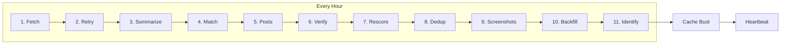
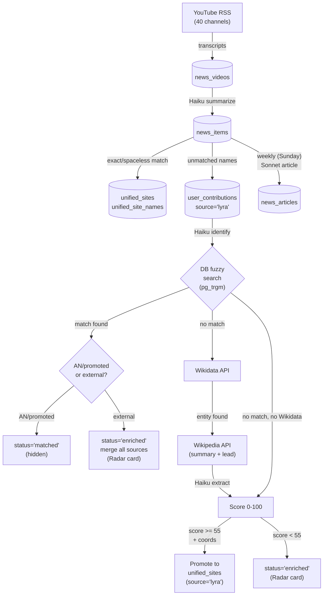
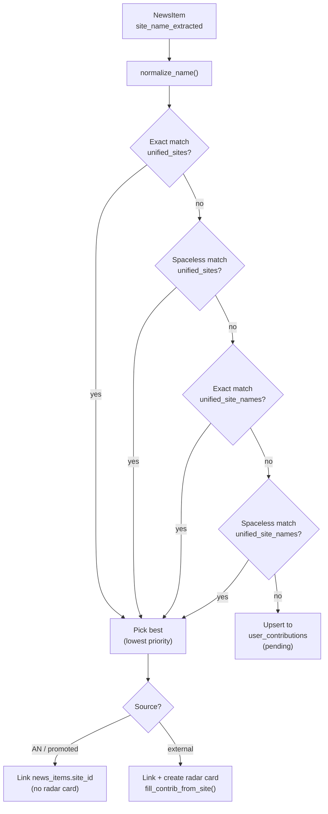
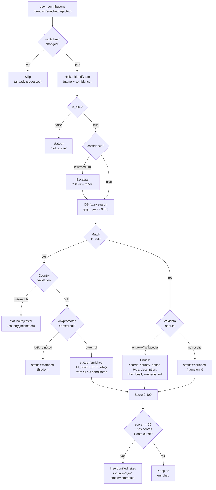
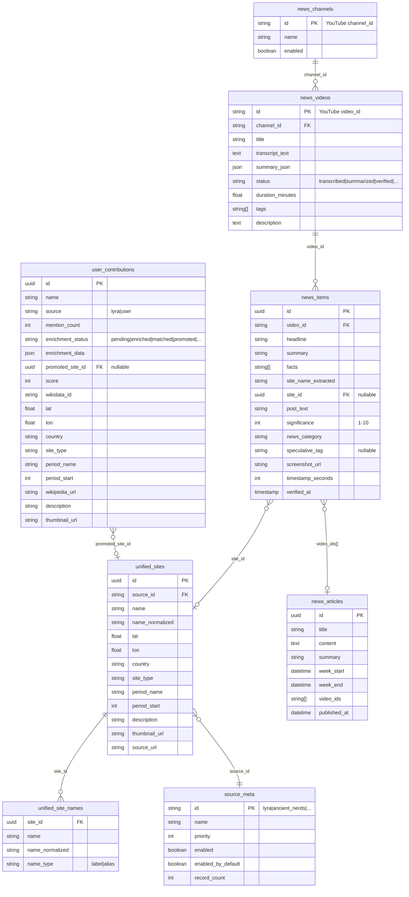
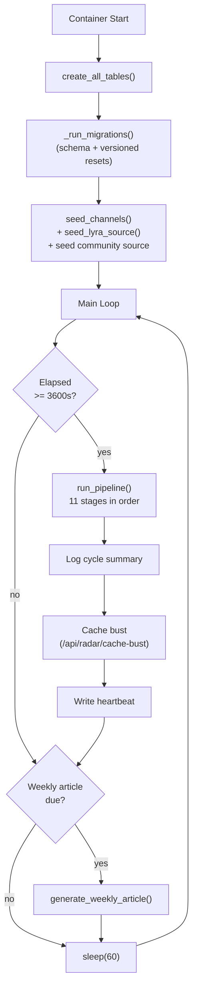
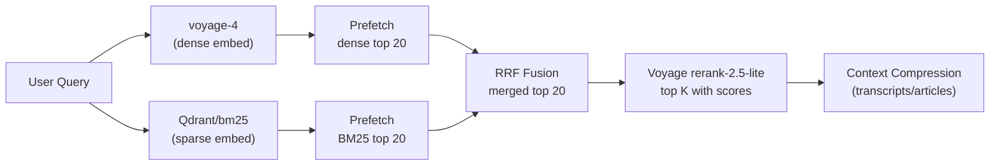

# Lyra News Pipeline

Fully-automated AI-powered archaeological news discovery system. Runs on a 1-hour cycle inside the `ancient_nerds_lyra` Docker container. Transforms raw YouTube video content into curated Radar cards through 11 sequential stages, plus a weekly article digest.

---

## Pipeline Overview


```mermaid
flowchart LR
    subgraph "Every Hour"
        F[1. Fetch] --> RT[2. Retry]
        RT --> S[3. Summarize]
        S --> M[4. Match]
        M --> P[5. Posts]
        P --> V[6. Verify]
        V --> R[7. Rescore]
        R --> D[8. Dedup]
        D --> SC[9. Screenshots]
        SC --> B[10. Backfill]
        B --> I[11. Identify]
    end
    I --> CB[Cache Bust]
    CB --> HB[Heartbeat]
```

| Stage | File | Entry Point | AI Model | Output Mode |
|-------|------|-------------|----------|-------------|
| 1. Fetch | `transcript_fetcher.py` | `fetch_new_videos()` | - | - |
| 2. Retry | `transcript_fetcher.py` | `retry_failed_videos()` | - | - |
| 3. Summarize | `summarizer.py` | `summarize_pending_videos()` | Haiku 4.5 | Structured output |
| 4. Match | `site_matcher.py` | `match_sites_for_pending_items()` | - | - |
| 5. Posts | `tweet_generator.py` | `generate_pending_posts()` | Sonnet 4.6 | Structured output |
| 6. Verify | `tweet_verifier.py` | `verify_pending_posts()` | Opus 4.6 | Structured output + adaptive thinking |
| 7. Rescore | `significance_scorer.py` | `rescore_pending_items()` | Haiku 4.5 | Structured output |
| 8. Dedup | `tweet_deduplicator.py` | `deduplicate_posts()` | - | - |
| 9. Screenshots | `screenshot_extractor.py` | `extract_screenshots()` | - | - |
| 10. Backfill | `transcript_fetcher.py` | `backfill_video_descriptions()` | - | - |
| 11. Identify | `site_identifier.py` | `identify_and_enrich_sites()` | Haiku 4.5 | Structured output |
| Weekly Article | `article_generator.py` | `generate_weekly_article()` | Sonnet 4.6 (cluster) / Opus 4.6 (write/verify/polish/headline) | Structured output (cluster) + adaptive thinking (write/verify/polish) + structured output (headline) |

---

## Data Flow


```mermaid
flowchart TD
    YT["YouTube RSS\n(40 channels)"] -->|transcripts| NV[(news_videos)]
    NV -->|Haiku summarize| NI[(news_items)]
    NI -->|exact/spaceless match| US[(unified_sites\nunified_site_names)]
    NI -->|unmatched names| UC[(user_contributions\nsource='lyra')]

    UC -->|Haiku identify| DB{"DB fuzzy\nsearch\n(pg_trgm)"}
    DB -->|match found| BRANCH{"AN/promoted\nor external?"}
    DB -->|no match| WD["Wikidata API"]

    BRANCH -->|AN/promoted| HIDDEN["status='matched'\n(hidden)"]
    BRANCH -->|external| ENRICHED["status='enriched'\nmerge all sources\n(Radar card)"]

    WD -->|entity found| WP["Wikipedia API\n(summary + lead)"]
    WP -->|Haiku extract| SCORE["Score 0-100"]
    DB -->|no match, no Wikidata| SCORE

    SCORE -->|"score >= 55\n+ coords"| PROMOTE["Promote to\nunified_sites\n(source='lyra')"]
    SCORE -->|"score < 55"| KEEP["status='enriched'\n(Radar card)"]

    NI -->|"weekly (Sunday)\nSonnet article"| NA[(news_articles)]
```

---

## Stage Details

### 1. Fetch (`transcript_fetcher.py`)

Fetches recent videos from 40 seed YouTube archaeology channels via RSS. Downloads transcripts (youtube-transcript-api, optional Webshare proxy) and metadata (yt-dlp). Skips videos < 5 minutes.

- **Reads:** `news_channels` (enabled only)
- **Writes:** `news_videos` (status=`transcribed` or `failed`)
- **External:** YouTube RSS, youtube-transcript-api, yt-dlp

### 2. Retry (`transcript_fetcher.py`)

Re-attempts transcript downloads for videos that failed in previous cycles (proxy issues, rate limits, transient errors). Same logic as fetch but targets `status = 'failed'` rows.

- **Reads:** `news_videos` (status=`failed`)
- **Writes:** `news_videos` (status=`transcribed` or remains `failed`)
- **External:** YouTube RSS, youtube-transcript-api, yt-dlp

### 3. Summarize (`summarizer.py`)

Sends full transcript to Haiku 4.5 with structured output. Extracts 2-8 key archaeological topics per video (scaled by duration). Includes a relevance gate that skips non-archaeology videos.

- **Reads:** `news_videos` (status=`transcribed`)
- **Writes:** `news_items` (headline, facts[], site_name_extracted), `news_videos.summary_json`
- **Model:** Haiku 4.5 (`prompts/summary.txt`, `prompts/relevance_gate.txt`)

### 4. Match (`site_matcher.py`)

Matches `news_items.site_name_extracted` against the curated sites database. Four strategies in order: exact name, spaceless name, exact alt-name, spaceless alt-name. Multiple candidates resolved by source priority.


```mermaid
flowchart TD
    NI["NewsItem\nsite_name_extracted"] --> NORM["normalize_name()"]
    NORM --> E1{"Exact match\nunified_sites?"}
    E1 -->|yes| PICK
    E1 -->|no| S1{"Spaceless match\nunified_sites?"}
    S1 -->|yes| PICK
    S1 -->|no| E2{"Exact match\nunified_site_names?"}
    E2 -->|yes| PICK
    E2 -->|no| S2{"Spaceless match\nunified_site_names?"}
    S2 -->|yes| PICK
    S2 -->|no| UNMATCHED["Upsert to\nuser_contributions\n(pending)"]

    PICK["Pick best\n(lowest priority)"] --> SRC{"Source?"}
    SRC -->|AN / promoted| LINK["Link news_items.site_id\n(no radar card)"]
    SRC -->|external| RADAR["Link + create radar card\nfill_contrib_from_site()"]
```

- **Reads:** `unified_sites`, `unified_site_names`, `news_videos.summary_json`
- **Writes:** `user_contributions` (upsert by lowercase name), `news_items.site_id`
- **Key function:** `fill_contrib_from_site()` -- canonical 10-field fill-if-missing

### 5. Posts (`tweet_generator.py`)

Generates short-form news feed posts from news items via Sonnet 4.6 with structured output. One post per item. Includes timestamp attribution and recency note. Significance scoring and categorization are handled by the separate rescore step.

- **Reads:** `news_items`, `news_videos.summary_json`
- **Writes:** `news_items.post_text`
- **Model:** Sonnet 4.6 (`prompts/tweet_template.txt`)

### 6. Verify (`tweet_verifier.py`)

Fact-checks posts against the transcript using Opus 4.6 with adaptive thinking and structured output. Extracts transcript segment around the timestamp (+/-10s buffer); falls back to first 3000 chars if segment extraction fails. Verdict: VERIFY_AS_IS / MODIFY / REJECT.

- **Reads:** `news_items.post_text`, `news_videos.transcript_text`
- **Writes:** `news_items.post_text` (modifications), `news_items.timestamp_seconds` (refinements)
- **Deletes:** rejected items (post_text set to NULL)
- **Model:** Opus 4.6 with adaptive thinking (`prompts/verify_tweets.txt`)

### 7. Rescore (`significance_scorer.py`)

Independent re-scoring of each verified item's significance (1-10) and category assignment using Haiku 4.5 with structured output. Items scored 1 (not archaeology) have their post_text set to NULL, removing them from the feed. This step was separated from post generation to avoid wasting tokens on scores the LLM generates poorly alongside creative writing.

- **Reads:** `news_items` (verified videos), `news_videos`
- **Writes:** `news_items.significance`, `news_items.news_category`, `news_items.speculative_tag`, `news_items.post_text` (NULL for score=1)
- **Video status:** `verified` → `rescored`
- **Model:** Haiku 4.5 (`prompts/rescore_significance.txt`)

### 8. Dedup (`tweet_deduplicator.py`)

Soft-deletes semantic duplicates. Feature extraction: numbers, words > 3 chars, URLs, timestamps. Weighted similarity: 40% numbers + 40% words + 20% metadata. Threshold configurable (default: 0.25). Keeps newest. Query bounded to 500 most recent items.

- **Reads:** `news_items` (with post_text, limit 500)
- **Soft-deletes:** `news_items.post_text` → NULL, `news_items.news_category` → "duplicate"

### 9. Screenshots (`screenshot_extractor.py`)

Extracts one frame per news item at the post timestamp. Two-step: yt-dlp downloads 3s clip (max 480p), ffmpeg extracts WebP frame (q75). 3 retries via Webshare auto-rotating proxy.

- **Reads:** `news_items.timestamp_seconds`
- **Writes:** `news_items.screenshot_url` -> `public/data/news/screenshots/{video_id}_{ts}.webp`
- **External:** yt-dlp (with proxy), ffmpeg

### 10. Backfill (`transcript_fetcher.py`)

Fills in missing video metadata (description, tags) for older videos via yt-dlp.

- **Reads/Writes:** `news_videos.description`, `news_videos.tags`

### 11. Identify + Enrich (`site_identifier.py`)

The core AI discovery engine. Processes up to 20 candidates per cycle.


```mermaid
flowchart TD
    START["user_contributions\n(pending/enriched/rejected)"] --> HASH{"Facts hash\nchanged?"}
    HASH -->|no| SKIP["Skip\n(already processed)"]
    HASH -->|yes| AI["Haiku: identify site\n(name + confidence)"]

    AI --> SITE{"is_site?"}
    SITE -->|false| NAS["status=\n'not_a_site'"]
    SITE -->|true| CONF{"confidence?"}

    CONF -->|low/medium| REVIEW["Escalate\nto review model"]
    CONF -->|high| DB
    REVIEW --> DB

    DB["DB fuzzy search\n(pg_trgm >= 0.35)"] --> DBMATCH{"Match\nfound?"}

    DBMATCH -->|yes| COUNTRY{"Country\nvalidation"}
    COUNTRY -->|mismatch| REJ["status='rejected'\n(country_mismatch)"]
    COUNTRY -->|ok| BRANCH{"AN/promoted\nor external?"}

    BRANCH -->|AN/promoted| MATCHED["status='matched'\n(hidden)"]
    BRANCH -->|external| EXT["status='enriched'\nfill_contrib_from_site()\nfrom all ext candidates"]

    DBMATCH -->|no| WD{"Wikidata\nsearch"}
    WD -->|entity w/ Wikipedia| ENRICH["Enrich:\ncoords, country, period,\ntype, description,\nthumbnail, wikipedia_url"]
    WD -->|no results| NEW["status='enriched'\n(name only)"]

    ENRICH --> SCORE["Score 0-100"]
    EXT --> SCORE
    NEW --> SCORE

    SCORE --> PROMOTE{"score >= 55\n+ has coords\n+ date cutoff?"}
    PROMOTE -->|yes| UNI["Insert unified_sites\n(source='lyra')\nstatus='promoted'"]
    PROMOTE -->|no| DONE["Keep as\nenriched"]
```

**Scoring breakdown:**

| Field | Points |
|-------|--------|
| Site name confirmed | 25 |
| Coordinates (lat/lon) | 20 |
| Country | 10 |
| Site type | 10 |
| Period / dating | 10 |
| Description (>= 50 chars) | 10 |
| Wikipedia URL | 5 |
| Thumbnail | 5 |
| Wikidata ID | 5 |
| **Max** | **100** |

Promotion threshold: **55** (requires coords + passes date cutoff).

### Weekly Article (`article_generator.py`)

Generates a magazine-quality weekly digest from the top-scoring news items. Runs Sunday evenings (20:00 UTC). The pipeline has 6 steps:

**0. Cluster** (Sonnet 4.6, structured output) — LLM groups items covering the same discovery/event (`prompts/article_cluster.txt`). For each cluster: highest-significance item wins, unique facts from runner-ups merge into its `merged_sources`, winner gets +1 significance boost (capped at 10), runner-ups are removed from the pool. This collapses 3 items about the same excavation into 1 richer item with multi-source citations. Falls back to no clustering on LLM failure.

**1. Select** — Diversity-penalized greedy selection (max 25 items). Repeats from the same video or category get significance penalties so fresh sources rise.

**2. Group & cite** — Items grouped by `news_category`, assigned monotonic citation numbers `[N]`. Merged sources from clustering also get their own citation numbers, so a clustered item might be `[3]` with corroborating sources `[4]` and `[5]`.

**3. Write body** (Opus 4.6, adaptive thinking, 128k max tokens) — all section payloads passed as plain text with `[N]` citation numbers. Clustered items include "Corroborated by [N] (channel):" blocks with their unique facts. The prompt requires every `[N]` in the source material to appear in the article.

**4. Verify** (Opus 4.6, adaptive thinking, 128k max tokens) — fact-checks article against source facts (including merged source facts). Outputs `[START_VERIFIED]...[END_VERIFIED]` markers around corrected article.

**5. Polish** (Opus 4.6, adaptive thinking, 128k max tokens) — editorial coherence pass. Smooths transitions, unifies tone. No source documents.

**5b. Citation cleanup** — scans the polished body for actually-used `[N]` references, removes uncited sources from the footer, and renumbers sequentially. Safety net for any corroborating sources the LLM didn't integrate despite the prompt instruction.

**6. Headline + TLDR** (Opus 4.6, structured output) — generates headline and summary from the polished body.

- **Reads:** `news_items` (significance >= 7 preferred, min 5 items), `news_videos`, `news_channels`
- **Writes:** `news_articles` (title, content, summary, week_start, week_end, video_ids)
- **Guard:** Skips if article for this week already exists (use `--force` in test script to override)

---

## Database Tables


```mermaid
erDiagram
    news_channels ||--o{ news_videos : "channel_id"
    news_videos ||--o{ news_items : "video_id"
    news_items }o--o| unified_sites : "site_id"
    user_contributions }o--o| unified_sites : "promoted_site_id"
    unified_sites ||--o{ unified_site_names : "site_id"
    unified_sites }o--|| source_meta : "source_id"
    news_items }o--o| news_articles : "video_ids[]"

    news_articles {
        uuid id PK
        string title
        text content
        string summary
        datetime week_start
        datetime week_end
        string[] video_ids
        datetime published_at
    }
    news_channels {
        string id PK "YouTube channel_id"
        string name
        boolean enabled
    }
    news_videos {
        string id PK "YouTube video_id"
        string channel_id FK
        string title
        text transcript_text
        json summary_json
        string status "transcribed|summarized|verified|..."
        float duration_minutes
        string[] tags
        text description
    }
    news_items {
        uuid id PK
        string video_id FK
        string headline
        string summary
        string[] facts
        string site_name_extracted
        uuid site_id FK "nullable"
        string post_text
        int significance "1-10"
        string news_category
        string speculative_tag "nullable"
        string screenshot_url
        int timestamp_seconds
        timestamp verified_at
    }
    user_contributions {
        uuid id PK
        string name
        string source "lyra|user"
        int mention_count
        string enrichment_status "pending|enriched|matched|promoted|..."
        json enrichment_data
        uuid promoted_site_id FK "nullable"
        int score
        string wikidata_id
        float lat
        float lon
        string country
        string site_type
        string period_name
        int period_start
        string wikipedia_url
        string description
        string thumbnail_url
    }
    unified_sites {
        uuid id PK
        string source_id FK
        string name
        string name_normalized
        float lat
        float lon
        string country
        string site_type
        string period_name
        int period_start
        string description
        string thumbnail_url
        string source_url
    }
    unified_site_names {
        uuid site_id FK
        string name
        string name_normalized
        string name_type "label|alias"
    }
    source_meta {
        string id PK "lyra|ancient_nerds|..."
        string name
        int priority
        boolean enabled
        boolean enabled_by_default
        int record_count
    }
```

---

## Status Codes

### `news_videos.status`

| Status | Meaning | Next Stage |
|--------|---------|------------|
| `transcribed` | Has transcript | Summarize |
| `failed` | No transcript available | Retry (after delay) |
| `skipped` | Too short (< 5 min) | - |
| `summarized` | summary_json populated | Posts |
| `posted` | Posts generated | Verify |
| `verified` | Posts fact-checked | Rescore |
| `rescored` | Significance rescored + categorized | Dedup/Screenshots |

### `user_contributions.enrichment_status`

| Status | Meaning | Visible on Radar? |
|--------|---------|:-:|
| `pending` | Awaiting identification | No |
| `enriching` | Currently processing (transient) | No |
| `enriched` | Identified + scored | Yes |
| `matched` | Matched to AN Original / promoted site | No |
| `rejected` | Country mismatch or other rejection | No |
| `promoted` | Promoted to `unified_sites` | Yes (as globe dot) |
| `failed` | Processing error | No |
| `not_a_site` | AI determined not an archaeological site | No |

---

## External APIs

| API | Used By | Purpose |
|-----|---------|---------|
| YouTube RSS | Fetch | Discover new videos from channels |
| youtube-transcript-api | Fetch | Download video captions |
| yt-dlp | Fetch, Screenshots, Backfill | Video metadata + frame extraction |
| ffmpeg | Screenshots | Extract WebP frame from clip |
| Anthropic API (Haiku 4.5) | Summarize, Rescore, Identify | High-volume extraction + scoring |
| Anthropic API (Sonnet 4.6) | Posts, Article (cluster) | Quality-critical writing |
| Anthropic API (Opus 4.6) | Verify, Article (write/verify/polish/headline) | Highest-quality reasoning + writing |
| Wikidata | Identify | Entity search + claims (coords, dates) |
| Wikipedia REST | Identify | Page summary + lead section |

### Structured Output

The pipeline uses Anthropic's native structured output (`output_config.format` with `json_schema`) for all steps that need guaranteed valid JSON. The `call_api()` helper in `config.py` converts the caller's `response_format` parameter to Anthropic's `output_config` format transparently. All JSON schemas comply with Anthropic's requirements: every property is in `required`, nullable fields use `anyOf` with `null`, and `additionalProperties: false` is set on all objects.

Article generation steps (write, verify, polish) use plain text output — they need the model to write inline `[N]` citation markers which structured output cannot enforce. The clustering step and headline step use structured output for their JSON responses.

---

## Shared Utilities

### `fill_contrib_from_site()` (`site_matcher.py`)

Canonical fill-if-missing function used by both matcher and identifier. Copies up to **10 fields** from a `UnifiedSite` into a `UserContribution`:

```
country, site_type, period_name, period_start,
lat, lon, description, thumbnail_url,
wikipedia_url (from site.source_url if wikipedia.org),
wikidata_id (from site.source_url if wikidata.org)
```

Called from 3 locations:
1. `site_matcher._upsert_lyra_suggestion()` -- external source match during matching
2. `site_identifier._handle_db_match()` -- pre-branch fill from best match
3. `site_identifier._handle_db_match()` -- external loop filling from all candidates

### `normalize_name()` (`pipeline/utils/text.py`)

Strips diacritics, lowercases, trims whitespace. Used for all name comparisons.

### `lookup_country()` (`pipeline/utils/country_lookup.py`)

PostGIS reverse geocoding: lat/lon -> country name. Fallback when Wikidata/AI don't provide country.

---

## Orchestrator Lifecycle


```mermaid
flowchart TD
    BOOT["Container Start"] --> TABLES["create_all_tables()"]
    TABLES --> MIG["_run_migrations()\n(schema + versioned resets)"]
    MIG --> SEED["seed_channels()\n+ seed_lyra_source()\n+ seed community source"]
    SEED --> LOOP["Main Loop"]

    LOOP --> CHECK{"Elapsed\n>= 3600s?"}
    CHECK -->|yes| RUN["run_pipeline()\n11 stages in order"]
    CHECK -->|no| ART{"Weekly article\ndue?"}

    RUN --> SUMMARY["Log cycle summary"]
    SUMMARY --> BUST["Cache bust\n(/api/radar/cache-bust)"]
    BUST --> HEART["Write heartbeat"]
    HEART --> ART

    ART -->|yes| GEN["generate_weekly_article()"]
    ART -->|no| SLEEP["sleep(60)"]
    GEN --> SLEEP
    SLEEP --> LOOP
```

The orchestrator runs `main()` which:
1. `create_all_tables()` — ensures all SQLAlchemy models exist
2. `_run_migrations()` — schema migrations (new columns, indexes) + versioned resets (v4-v16 + named resets) to re-queue items when prompts/logic change
3. `seed_channels()` — 40 YouTube archaeology channels
4. `seed_lyra_source()` + seed `ancient_nerds_community` source
5. Enters infinite loop: run pipeline every hour, generate article weekly, heartbeat after each cycle

---

## Vector Search (Qdrant)

The RAG agent uses hybrid semantic search powered by Qdrant. Five collections index different data types for retrieval.

### Collections

| Collection | Source Data | PG Table | Granularity | Payload Indexes |
|------------|-----------|----------|-------------|-----------------|
| `sites` | Curated archaeological sites | `unified_sites` (source='ancient_nerds') | 1 point per site | country, period_name, site_type |
| `news` | AI-extracted news items | `news_items` | 1 point per item | channel, category |
| `transcripts` | Video transcript text | `news_videos` (transcribed/summarized) | Overlapping 2K-char chunks | channel, video_id |
| `articles` | Weekly digest articles | `news_articles` | Overlapping 2K-char chunks | article_id |
| `empires` | Seshat historical polities | `polities.json` (46 polities) | 1 point per polity | polity_id, region |

Each collection stores two named vectors per point:
- **dense**: voyage-4-large embeddings (1024-dim, COSINE distance)
- **bm25**: Qdrant/fastembed sparse vectors (IDF-weighted)

### Indexing Script

```bash
# Index all collections (incremental — skips existing)
python scripts/build_lyra_index.py

# Index a single collection
python scripts/build_lyra_index.py --collection sites
python scripts/build_lyra_index.py --collection news
python scripts/build_lyra_index.py --collection transcripts
python scripts/build_lyra_index.py --collection articles
python scripts/build_lyra_index.py --collection empires

# Wipe and rebuild from scratch
python scripts/build_lyra_index.py --rebuild
python scripts/build_lyra_index.py --collection transcripts --rebuild
```

The script (`scripts/build_lyra_index.py`) uses voyage-4-large for dense embeddings (highest quality) and Qdrant's built-in BM25 sparse model via fastembed for sparse vectors.

### Hybrid Search Pipeline


```mermaid
flowchart LR
    Q["User Query"] --> DE["voyage-4\n(dense embed)"]
    Q --> SE["Qdrant/bm25\n(sparse embed)"]
    DE --> PF1["Prefetch\ndense top 20"]
    SE --> PF2["Prefetch\nBM25 top 20"]
    PF1 --> RRF["RRF Fusion\nmerged top 20"]
    PF2 --> RRF
    RRF --> RR["Voyage rerank-2.5-lite\ntop K with scores"]
    RR --> CC["Context Compression\n(transcripts/articles)"]
```

1. **Embed query** — Dense via voyage-4 (query-optimized, shared space with voyage-4-large) + sparse via Qdrant/bm25 (local fastembed)
2. **Prefetch** — Dense ANN top 20 + BM25 inverted index top 20, with optional metadata filters
3. **RRF fusion** — Reciprocal Rank Fusion merges both result lists
4. **Rerank** — Voyage rerank-2.5-lite cross-encoder scores each (query, document) pair. Collection-specific instructions prepended to query for optimal ranking.
5. **Context compression** (transcripts/articles only) — Splits each reranked chunk into sentences, batch-reranks sentences against the query, keeps only sentences scoring above 0.3 or top 5 per chunk. Reduces noise from 2000-char chunks to focused passages.

### Lyra RAG Tools

12 tools are available to the agent, mapped to collections:

| Tool | Collection | Description |
|------|-----------|-------------|
| `search_sites` | — (SQL) | Structured SQL search with period/country/type filters |
| `get_site_details` | — (SQL) | Full site info by UUID or name |
| `search_news` | — (SQL) | Recent news by keyword, channel, days_back |
| `get_empire_data` | — (JSON) | Full Seshat polity data by ID |
| `vector_search` | any | Deep-dive hybrid search with metadata filters (including transcripts via collection="transcripts") |
| `search_radar` | — (SQL) | Lyra's auto-discovered sites |
| `list_channels` | — (SQL) | Monitored YouTube channels |
| `get_site_images` | — (SQL) | Wikimedia Commons images for a site (returns pre-formatted markdown with attribution links to Commons) |
| `search_articles` | articles | Hybrid search on weekly digest article chunks |
| `search_empires` | empires | Hybrid search on Seshat polity data |
| `search_transcripts` | transcripts | Hybrid search on YouTube transcript chunks |
| `web_search` | — (Anthropic) | Live internet search via Anthropic's server-side web search tool (`web_search_20250305`). User-toggled, costs +2 credits per search. On round 0, only `web_search` is offered (no DB tools) to prevent server/client tool conflicts. Results are cited as `«l0»` link markers with source URLs. Max 3 searches per request. |

Auto-retrieve runs before the LLM on every query. For complex multi-part queries (e.g. "compare Göbekli Tepe and Stonehenge"), the agent decomposes the query into 1-3 sub-queries first (`_decompose_query()`), then runs hybrid search per sub-query on sites (top 5) + news (top 3). Results are merged by ID, semantically deduped (token Jaccard ≥ 0.7), and reordered for lost-in-the-middle mitigation (most relevant at start and end of context). The remaining collections (transcripts, articles, empires) are available via tool calls.

---

## Lyra Chat — Architecture

The Lyra chat agent uses Anthropic Haiku 4.5 as its cloud backend, with the Anthropic citations API for grounded RAG responses.

### Intent Classification

An LLM-powered intent classifier (`_classify_intent` in `lyra_agent.py`) categorizes each incoming message as `trivial` (greetings, meta questions) or `substantive` (archaeology queries). Trivial messages skip the retrieval pipeline for lower latency. This runs in parallel with auto-retrieval so it adds no latency to substantive queries.

### Backend

| Backend | Model | Use Case |
|---------|-------|----------|
| **Anthropic** | Haiku 4.5 | All chat requests — streaming, structured output, tool calling, citations |

A local Ollama backend (`lyra_queue.py`, `lyra_backends.py`) exists in the codebase but is not currently wired into the chat flow.

### Unified Backend Abstraction

All backends implement the same `LLMBackend.stream()` protocol, yielding 4 event types:
- `reasoning` — thinking/reasoning tokens
- `content` — visible response tokens
- `tool_call_chunk` — streaming tool call arguments
- `usage` — token counts

### Structured Output (Chat Responses)

Anthropic Haiku uses structured output to guarantee well-formed references in Lyra's responses. Instead of fragile regex enrichment on free-form markdown, the LLM outputs structured JSON with guillemet markers.

### Citations (RAG Grounding)

The chat agent uses Anthropic's citations API for RAG synthesis. Retrieved data is passed as a document block with `citations: {"enabled": True}`, and the API returns exact text pointers into the source material. This ensures every claim is grounded in actual retrieved data. Citations are incompatible with structured output, so the agent uses them only for the prose synthesis step (not the structured marker extraction step).

**Schema** (`api/services/lyra_schema.py`):

```
LyraResponse {
  text: string          // Markdown with «s0», «c0», «v0», «e0», «i0», «l0», «f0» markers
  sites: [{marker, name, id}]
  coords: [{marker, lat, lon}]
  videos: [{marker, channel, video_id, timestamp_seconds}]
  empires: [{marker, name, polity_id}]
  images: [{marker, title, original_url, author, license, commons_page_url}]
  links: [{marker, text, url}]
  countries: [{marker, name, code}]
}
```

**Marker expansion** (`expand_markers()`):
- `«sN»` → `[name](site:UUID)` — clickable site chips
- `«cN»` → `[lat, lon](lyra-coord:lat,lon)` — coordinate links
- `«vN»` → `[▶ channel MM:SS](lyra-video:INDEX)` — video citations with timestamps
- `«eN»` → `[name](empire:polity_id)` — empire links
- `«iN»` → `` + `*[Photo: author · license](commons_url)*` — inline images with Wikimedia attribution link
- `«lN»` → `[text](url)` — external links
- `«fN»` → `[name](flag:code)` — country flag chips

**Two injection points** in `lyra_agent.py`:
1. **Normal final response** (~line 885): After streaming completes with no tool calls, calls `AnthropicBackend.complete()` with `LYRA_RESPONSE_SCHEMA`, runs `expand_markers()`, emits as diffusion replacement.
2. **Forced final response** (~line 1177): When max tool rounds exhausted, same structured output flow.

Both points have fallback paths that strip unresolved guillemet markers if `complete()` fails.

### Test Suite (`scripts/test_lyra_quality.py`)

Comprehensive quality validation: 65 tests across 19 categories, combining 19 structural checks with an LLM judge and faithfulness evaluation.

**Structural checks** (deterministic): site link format, coordinate ranges, UUID validity, video citations, empire links, image format, country flags, bare UUID detection, marker resolution, conciseness, tool invocations, hallucinated IDs.

**Post-processing** (`_filter_hallucinated_videos`): After structured output expansion, videos not found in the news DB are stripped. The filter removes the entire sentence containing the video link (not just the link itself) to prevent dangling text like "watch ." or "As shown in , the temple...".

**LLM judge** (structured output): relevance score (0-10), site linking, source citations, conciseness, accuracy, marker usage, overall pass/fail. Uses structured output for guaranteed valid JSON scoring.

**Faithfulness scoring** (structured output): Extracts every factual claim from the response, checks whether each is supported/unsupported/contradicted by retrieved context. Calculates faithfulness_score = supported / total claims. Tests fail if score < 0.8 (configurable per test). Only runs with the full judge (not `--no-judge`). 5 faithfulness test cases covering site queries, transcript attribution, news grounding, comparisons, and source descriptions.
