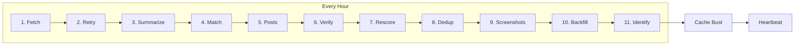
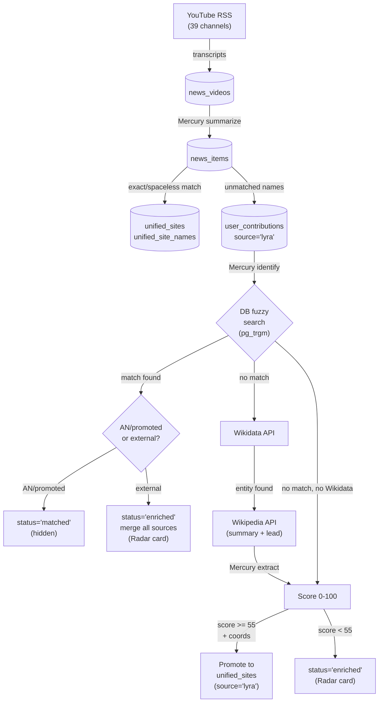
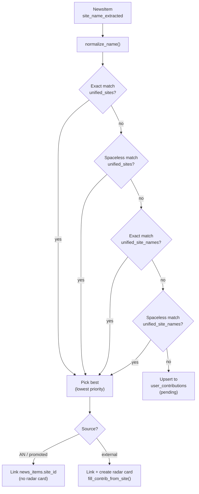
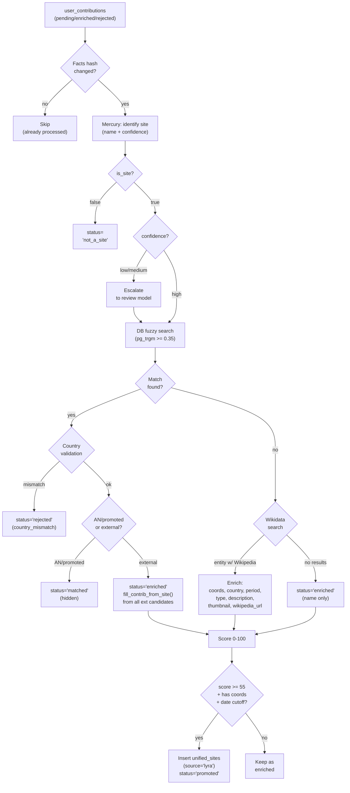
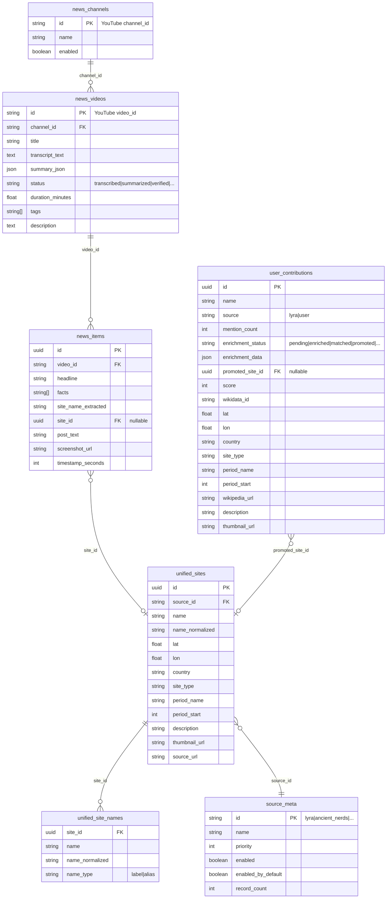
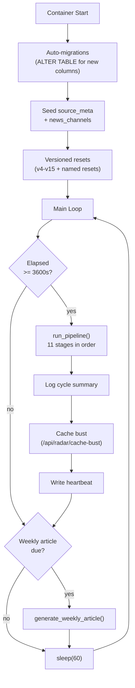
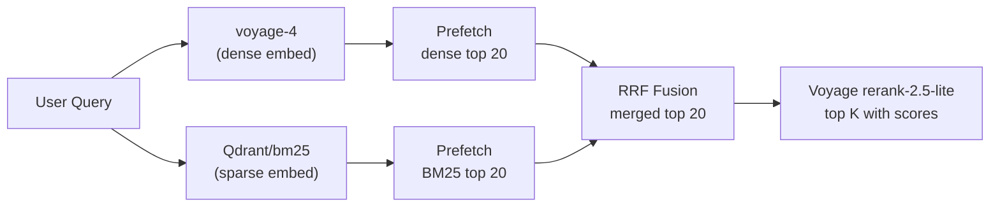

# Lyra News Pipeline

Fully-automated AI-powered archaeological news discovery system. Runs on a 1-hour cycle inside the `ancient_nerds_lyra` Docker container. Transforms raw YouTube video content into curated Radar cards through 11 sequential stages.

---

## Pipeline Overview


```mermaid
flowchart LR
    subgraph "Every Hour"
        F[1. Fetch] --> RT[2. Retry]
        RT --> S[3. Summarize]
        S --> M[4. Match]
        M --> P[5. Posts]
        P --> V[6. Verify]
        V --> R[7. Rescore]
        R --> D[8. Dedup]
        D --> SC[9. Screenshots]
        SC --> B[10. Backfill]
        B --> I[11. Identify]
    end
    I --> CB[Cache Bust]
    CB --> HB[Heartbeat]
```

| Stage | File | Entry Point | AI Model |
|-------|------|-------------|----------|
| 1. Fetch | `transcript_fetcher.py` | `fetch_new_videos()` | - |
| 2. Retry | `transcript_fetcher.py` | `retry_failed_videos()` | - |
| 3. Summarize | `summarizer.py` | `summarize_pending_videos()` | Mercury 2 |
| 4. Match | `site_matcher.py` | `match_sites_for_pending_items()` | - |
| 5. Posts | `tweet_generator.py` | `generate_pending_posts()` | Mercury 2 |
| 6. Verify | `tweet_verifier.py` | `verify_pending_posts()` | Mercury 2 |
| 7. Rescore | `significance_scorer.py` | `rescore_pending_items()` | Mercury 2 |
| 8. Dedup | `tweet_deduplicator.py` | `deduplicate_posts()` | - |
| 9. Screenshots | `screenshot_extractor.py` | `extract_screenshots()` | - |
| 10. Backfill | `transcript_fetcher.py` | `backfill_video_descriptions()` | - |
| 11. Identify | `site_identifier.py` | `identify_and_enrich_sites()` | Mercury 2 |

---

## Data Flow


```mermaid
flowchart TD
    YT["YouTube RSS\n(39 channels)"] -->|transcripts| NV[(news_videos)]
    NV -->|Mercury summarize| NI[(news_items)]
    NI -->|exact/spaceless match| US[(unified_sites\nunified_site_names)]
    NI -->|unmatched names| UC[(user_contributions\nsource='lyra')]

    UC -->|Mercury identify| DB{"DB fuzzy\nsearch\n(pg_trgm)"}
    DB -->|match found| BRANCH{"AN/promoted\nor external?"}
    DB -->|no match| WD["Wikidata API"]

    BRANCH -->|AN/promoted| HIDDEN["status='matched'\n(hidden)"]
    BRANCH -->|external| ENRICHED["status='enriched'\nmerge all sources\n(Radar card)"]

    WD -->|entity found| WP["Wikipedia API\n(summary + lead)"]
    WP -->|Mercury extract| SCORE["Score 0-100"]
    DB -->|no match, no Wikidata| SCORE

    SCORE -->|"score >= 55\n+ coords"| PROMOTE["Promote to\nunified_sites\n(source='lyra')"]
    SCORE -->|"score < 55"| KEEP["status='enriched'\n(Radar card)"]
```

---

## Stage Details

### 1. Fetch (`transcript_fetcher.py`)

Fetches recent videos from 35 seed YouTube archaeology channels via RSS. Downloads transcripts (youtube-transcript-api, optional Webshare proxy) and metadata (yt-dlp). Skips videos < 5 minutes.

- **Reads:** `news_channels` (enabled only)
- **Writes:** `news_videos` (status=`transcribed` or `failed`)
- **External:** YouTube RSS, youtube-transcript-api, yt-dlp

### 2. Retry (`transcript_fetcher.py`)

Re-attempts transcript downloads for videos that failed in previous cycles (proxy issues, rate limits, transient errors). Same logic as fetch but targets `status = 'failed'` rows.

- **Reads:** `news_videos` (status=`failed`)
- **Writes:** `news_videos` (status=`transcribed` or remains `failed`)
- **External:** YouTube RSS, youtube-transcript-api, yt-dlp

### 3. Summarize (`summarizer.py`)

Sends full transcript to Mercury 2. Extracts 2-8 key archaeological topics per video (scaled by duration).

- **Reads:** `news_videos` (status=`transcribed`)
- **Writes:** `news_items` (headline, facts[], site_name_extracted), `news_videos.summary_json`
- **Model:** Mercury 2 (`prompts/summary.txt`)

### 4. Match (`site_matcher.py`)

Matches `news_items.site_name_extracted` against the curated sites database. Four strategies in order: exact name, spaceless name, exact alt-name, spaceless alt-name. Multiple candidates resolved by source priority.


```mermaid
flowchart TD
    NI["NewsItem\nsite_name_extracted"] --> NORM["normalize_name()"]
    NORM --> E1{"Exact match\nunified_sites?"}
    E1 -->|yes| PICK
    E1 -->|no| S1{"Spaceless match\nunified_sites?"}
    S1 -->|yes| PICK
    S1 -->|no| E2{"Exact match\nunified_site_names?"}
    E2 -->|yes| PICK
    E2 -->|no| S2{"Spaceless match\nunified_site_names?"}
    S2 -->|yes| PICK
    S2 -->|no| UNMATCHED["Upsert to\nuser_contributions\n(pending)"]

    PICK["Pick best\n(lowest priority)"] --> SRC{"Source?"}
    SRC -->|AN / promoted| LINK["Link news_items.site_id\n(no radar card)"]
    SRC -->|external| RADAR["Link + create radar card\nfill_contrib_from_site()"]
```

- **Reads:** `unified_sites`, `unified_site_names`, `news_videos.summary_json`
- **Writes:** `user_contributions` (upsert by lowercase name), `news_items.site_id`
- **Key function:** `fill_contrib_from_site()` -- canonical 10-field fill-if-missing

### 5. Posts (`tweet_generator.py`)

Generates short-form news feed posts (max 170 chars) from news items via Mercury 2. One post per item. Includes timestamp attribution and recency note. Significance scoring and categorization are handled by the separate rescore step (5b).

- **Reads:** `news_items`, `news_videos.summary_json`
- **Writes:** `news_items.post_text`
- **Model:** Mercury 2 (`prompts/tweet_template.txt`)
- **Security:** Shared API client pool, prompt caching (ephemeral)

### 6. Verify (`tweet_verifier.py`)

Fact-checks posts against the transcript segment around the timestamp (+/-10s). Verdict: VERIFY_AS_IS / MODIFY / REJECT.

- **Reads:** `news_items.post_text`, `news_videos.transcript_text`
- **Writes:** `news_items.post_text` (modifications), `news_items.timestamp_seconds` (refinements)
- **Deletes:** rejected items (post_text set to NULL)
- **Model:** Mercury 2 (`prompts/verify_tweets.txt`)
- **Security:** Prompt injection guard on transcript segment

### 7. Rescore (`significance_scorer.py`)

Independent re-scoring of each verified item's significance (1-10) and category assignment. Items scored 1 (not archaeology) have their post_text set to NULL, removing them from the feed. This step was separated from post generation to avoid wasting tokens on scores the LLM generates poorly alongside creative writing.

- **Reads:** `news_items` (verified videos), `news_videos`
- **Writes:** `news_items.significance`, `news_items.news_category`, `news_items.post_text` (NULL for score=1)
- **Video status:** `verified` → `rescored`
- **Model:** Mercury 2 (`prompts/rescore_significance.txt`)
- **Security:** Shared API client pool, prompt caching, injection guard

### 8. Dedup (`tweet_deduplicator.py`)

Soft-deletes semantic duplicates. Feature extraction: numbers, words > 3 chars, URLs, timestamps. Weighted similarity: 40% numbers + 40% words + 20% metadata. Threshold configurable (default: 0.25). Keeps newest. Query bounded to 500 most recent items.

- **Reads:** `news_items` (with post_text, limit 500)
- **Soft-deletes:** `news_items.post_text` → NULL, `news_items.news_category` → "duplicate"

### 9. Screenshots (`screenshot_extractor.py`)

Extracts one frame per news item at the post timestamp. Two-step: yt-dlp downloads 3s clip (max 480p), ffmpeg extracts WebP frame (q75). 4 parallel workers, 3 retries with proxy rotation.

- **Reads:** `news_items.timestamp_seconds`
- **Writes:** `news_items.screenshot_url` -> `public/data/news/screenshots/{video_id}_{ts}.webp`
- **External:** yt-dlp (with proxy), ffmpeg

### 10. Backfill (`transcript_fetcher.py`)

Fills in missing video metadata (description, tags) for older videos via yt-dlp.

- **Reads/Writes:** `news_videos.description`, `news_videos.tags`

### 11. Identify + Enrich (`site_identifier.py`)

The core AI discovery engine. Processes up to 20 candidates per cycle.


```mermaid
flowchart TD
    START["user_contributions\n(pending/enriched/rejected)"] --> HASH{"Facts hash\nchanged?"}
    HASH -->|no| SKIP["Skip\n(already processed)"]
    HASH -->|yes| AI["Mercury: identify site\n(name + confidence)"]

    AI --> SITE{"is_site?"}
    SITE -->|false| NAS["status=\n'not_a_site'"]
    SITE -->|true| CONF{"confidence?"}

    CONF -->|low/medium| REVIEW["Escalate\nto review model"]
    CONF -->|high| DB
    REVIEW --> DB

    DB["DB fuzzy search\n(pg_trgm >= 0.35)"] --> DBMATCH{"Match\nfound?"}

    DBMATCH -->|yes| COUNTRY{"Country\nvalidation"}
    COUNTRY -->|mismatch| REJ["status='rejected'\n(country_mismatch)"]
    COUNTRY -->|ok| BRANCH{"AN/promoted\nor external?"}

    BRANCH -->|AN/promoted| MATCHED["status='matched'\n(hidden)"]
    BRANCH -->|external| EXT["status='enriched'\nfill_contrib_from_site()\nfrom all ext candidates"]

    DBMATCH -->|no| WD{"Wikidata\nsearch"}
    WD -->|entity w/ Wikipedia| ENRICH["Enrich:\ncoords, country, period,\ntype, description,\nthumbnail, wikipedia_url"]
    WD -->|no results| NEW["status='enriched'\n(name only)"]

    ENRICH --> SCORE["Score 0-100"]
    EXT --> SCORE
    NEW --> SCORE

    SCORE --> PROMOTE{"score >= 55\n+ has coords\n+ date cutoff?"}
    PROMOTE -->|yes| UNI["Insert unified_sites\n(source='lyra')\nstatus='promoted'"]
    PROMOTE -->|no| DONE["Keep as\nenriched"]
```

**Scoring breakdown:**

| Field | Points |
|-------|--------|
| Site name confirmed | 25 |
| Coordinates (lat/lon) | 20 |
| Country | 10 |
| Site type | 10 |
| Period / dating | 10 |
| Description (>= 50 chars) | 10 |
| Wikipedia URL | 5 |
| Thumbnail | 5 |
| Wikidata ID | 5 |
| **Max** | **100** |

Promotion threshold: **55** (requires coords + passes date cutoff).

---

## Database Tables


```mermaid
erDiagram
    news_channels ||--o{ news_videos : "channel_id"
    news_videos ||--o{ news_items : "video_id"
    news_items }o--o| unified_sites : "site_id"
    user_contributions }o--o| unified_sites : "promoted_site_id"
    unified_sites ||--o{ unified_site_names : "site_id"
    unified_sites }o--|| source_meta : "source_id"

    news_channels {
        string id PK "YouTube channel_id"
        string name
        boolean enabled
    }
    news_videos {
        string id PK "YouTube video_id"
        string channel_id FK
        string title
        text transcript_text
        json summary_json
        string status "transcribed|summarized|verified|..."
        float duration_minutes
        string[] tags
        text description
    }
    news_items {
        uuid id PK
        string video_id FK
        string headline
        string[] facts
        string site_name_extracted
        uuid site_id FK "nullable"
        string post_text
        string screenshot_url
        int timestamp_seconds
    }
    user_contributions {
        uuid id PK
        string name
        string source "lyra|user"
        int mention_count
        string enrichment_status "pending|enriched|matched|promoted|..."
        json enrichment_data
        uuid promoted_site_id FK "nullable"
        int score
        string wikidata_id
        float lat
        float lon
        string country
        string site_type
        string period_name
        int period_start
        string wikipedia_url
        string description
        string thumbnail_url
    }
    unified_sites {
        uuid id PK
        string source_id FK
        string name
        string name_normalized
        float lat
        float lon
        string country
        string site_type
        string period_name
        int period_start
        string description
        string thumbnail_url
        string source_url
    }
    unified_site_names {
        uuid site_id FK
        string name
        string name_normalized
        string name_type "label|alias"
    }
    source_meta {
        string id PK "lyra|ancient_nerds|..."
        string name
        int priority
        boolean enabled
        boolean enabled_by_default
        int record_count
    }
```

---

## Status Codes

### `news_videos.status`

| Status | Meaning | Next Stage |
|--------|---------|------------|
| `transcribed` | Has transcript | Summarize |
| `failed` | No transcript available | Retry (after delay) |
| `skipped` | Too short (< 5 min) | - |
| `summarized` | summary_json populated | Posts |
| `posted` | Posts generated | Verify |
| `verified` | Posts fact-checked | Rescore |
| `rescored` | Significance rescored + categorized | Dedup/Screenshots |

### `user_contributions.enrichment_status`

| Status | Meaning | Visible on Radar? |
|--------|---------|:-:|
| `pending` | Awaiting identification | No |
| `enriching` | Currently processing (transient) | No |
| `enriched` | Identified + scored | Yes |
| `matched` | Matched to AN Original / promoted site | No |
| `rejected` | Country mismatch or other rejection | No |
| `promoted` | Promoted to `unified_sites` | Yes (as globe dot) |
| `failed` | Processing error | No |
| `not_a_site` | AI determined not an archaeological site | No |

---

## External APIs

| API | Used By | Purpose |
|-----|---------|---------|
| YouTube RSS | Fetch | Discover new videos from channels |
| youtube-transcript-api | Fetch | Download video captions |
| yt-dlp | Fetch, Screenshots, Backfill | Video metadata + frame extraction |
| ffmpeg | Screenshots | Extract WebP frame from clip |
| Mercury 2 (via Anthropic SDK) | Summarize, Verify, Rescore, Identify, Extract Metadata, Pick Entity, Posts | AI processing + creative generation |
| Wikidata | Identify | Entity search + claims (coords, dates) |

### Structured Output

Mercury 2 supports `response_format: json_schema` with `strict: true` for reliable structured output. All pipeline LLM calls use this instead of the legacy assistant prefill pattern. The `call_api()` helper in `config.py` handles schema enforcement transparently.

| Wikipedia REST | Identify | Page summary + lead section |

---

## Shared Utilities

### `fill_contrib_from_site()` (`site_matcher.py`)

Canonical fill-if-missing function used by both matcher and identifier. Copies **10 fields** from a `UnifiedSite` into a `UserContribution`:

```
country, site_type, period_name, period_start,
lat, lon, description, thumbnail_url,
wikipedia_url (from site.source_url)
```

Called from 3 locations:
1. `site_matcher._upsert_lyra_suggestion()` -- external source match during matching
2. `site_identifier._handle_db_match()` -- pre-branch fill from best match
3. `site_identifier._handle_db_match()` -- external loop filling from all candidates

### `normalize_name()` (`pipeline/utils/text.py`)

Strips diacritics, lowercases, trims whitespace. Used for all name comparisons.

### `lookup_country()` (`pipeline/utils/country_lookup.py`)

PostGIS reverse geocoding: lat/lon -> country name. Fallback when Wikidata/AI don't provide country.

---

## Orchestrator Lifecycle


```mermaid
flowchart TD
    BOOT["Container Start"] --> MIG["Auto-migrations\n(ALTER TABLE for new columns)"]
    MIG --> SEED["Seed source_meta\n+ news_channels"]
    SEED --> RESET["Versioned resets\n(v4-v15 + named resets)"]
    RESET --> LOOP["Main Loop"]

    LOOP --> CHECK{"Elapsed\n>= 3600s?"}
    CHECK -->|yes| RUN["run_pipeline()\n11 stages in order"]
    CHECK -->|no| ART{"Weekly article\ndue?"}

    RUN --> SUMMARY["Log cycle summary"]
    SUMMARY --> BUST["Cache bust\n(/api/radar/cache-bust)"]
    BUST --> HEART["Write heartbeat"]
    HEART --> ART

    ART -->|yes| GEN["generate_weekly_article()"]
    ART -->|no| SLEEP["sleep(60)"]
    GEN --> SLEEP
    SLEEP --> LOOP
```

The orchestrator runs `main()` which:
1. Applies auto-migrations (new columns, indexes, table renames)
2. Seeds `source_meta` ('lyra') and `news_channels` (39 YouTube channels)
3. Applies versioned resets (v4-v15 + named resets) to re-queue items when prompts/logic change
4. Enters infinite loop: run pipeline every hour, generate article weekly, heartbeat after each cycle

---

## Vector Search (Qdrant)

The RAG agent uses hybrid semantic search powered by Qdrant. Five collections index different data types for retrieval.

### Collections

| Collection | Source Data | PG Table | Granularity | Payload Indexes |
|------------|-----------|----------|-------------|-----------------|
| `sites` | Curated archaeological sites | `unified_sites` (source='ancient_nerds') | 1 point per site | country, period_name, site_type |
| `news` | AI-extracted news items | `news_items` | 1 point per item | channel, category |
| `transcripts` | Video transcript text | `news_videos` (transcribed/summarized) | Overlapping 2K-char chunks | channel, video_id |
| `articles` | Weekly digest articles | `news_articles` | Overlapping 2K-char chunks | article_id |
| `empires` | Seshat historical polities | `polities.json` (46 polities) | 1 point per polity | polity_id, region |

Each collection stores two named vectors per point:
- **dense**: voyage-4-large embeddings (1024-dim, COSINE distance)
- **bm25**: Qdrant/fastembed sparse vectors (IDF-weighted)

### Indexing Script

```bash
# Index all collections (incremental — skips existing)
python scripts/build_lyra_index.py

# Index a single collection
python scripts/build_lyra_index.py --collection sites
python scripts/build_lyra_index.py --collection news
python scripts/build_lyra_index.py --collection transcripts
python scripts/build_lyra_index.py --collection articles
python scripts/build_lyra_index.py --collection empires

# Wipe and rebuild from scratch
python scripts/build_lyra_index.py --rebuild
python scripts/build_lyra_index.py --collection transcripts --rebuild
```

The script (`scripts/build_lyra_index.py`) uses voyage-4-large for dense embeddings (highest quality) and Qdrant's built-in BM25 sparse model via fastembed for sparse vectors.

### Hybrid Search Pipeline


```mermaid
flowchart LR
    Q["User Query"] --> DE["voyage-4\n(dense embed)"]
    Q --> SE["Qdrant/bm25\n(sparse embed)"]
    DE --> PF1["Prefetch\ndense top 20"]
    SE --> PF2["Prefetch\nBM25 top 20"]
    PF1 --> RRF["RRF Fusion\nmerged top 20"]
    PF2 --> RRF
    RRF --> RR["Voyage rerank-2.5-lite\ntop K with scores"]
```

1. **Embed query** — Dense via voyage-4 (query-optimized, shared space with voyage-4-large) + sparse via Qdrant/bm25 (local fastembed)
2. **Prefetch** — Dense ANN top 20 + BM25 inverted index top 20, with optional metadata filters
3. **RRF fusion** — Reciprocal Rank Fusion merges both result lists
4. **Rerank** — Voyage rerank-2.5-lite cross-encoder scores each (query, document) pair. Collection-specific instructions prepended to query for optimal ranking.

### Lyra RAG Tools

11 tools are available to the agent, mapped to collections:

| Tool | Collection | Description |
|------|-----------|-------------|
| `search_sites` | — (SQL) | Structured SQL search with period/country/type filters |
| `get_site_details` | — (SQL) | Full site info by UUID or name |
| `search_news` | — (SQL) | Recent news by keyword, channel, days_back |
| `get_empire_data` | — (JSON) | Full Seshat polity data by ID |
| `vector_search` | any | Deep-dive hybrid search with metadata filters |
| `search_radar` | — (SQL) | Lyra's auto-discovered sites |
| `list_channels` | — (SQL) | Monitored YouTube channels |
| `get_site_images` | — (SQL) | Wikimedia Commons images for a site |
| `search_transcripts` | transcripts | Hybrid search on transcript chunks with YouTube deep links |
| `search_articles` | articles | Hybrid search on weekly digest article chunks |
| `search_empires` | empires | Hybrid search on Seshat polity data |

Auto-retrieve runs before the LLM on every query, searching sites (top 5) + news (top 3). The remaining collections (transcripts, articles, empires) are available via tool calls.

---

## Lyra Chat — Architecture

The Lyra chat agent uses Mercury 2 (by Inception Labs) as its cloud backend.

### Intent Classification

An LLM-powered intent classifier (`_classify_intent` in `lyra_agent.py`) categorizes each incoming message as `trivial` (greetings, meta questions) or `substantive` (archaeology queries). Trivial messages skip the retrieval pipeline for lower latency. This runs in parallel with auto-retrieval so it adds no latency to substantive queries.

### Backend

| Backend | Model | Use Case |
|---------|-------|----------|
| **Mercury** | Mercury 2 | All chat requests — streaming, structured output, tool calling |

The backend is restricted to `"mercury"` in the API schema. A local Ollama backend (`lyra_queue.py`, `lyra_backends.py`) exists in the codebase but is not currently wired into the chat flow.

### Unified Backend Abstraction

All backends implement the same `LLMBackend.stream()` protocol, yielding 4 event types:
- `reasoning` — thinking/reasoning tokens
- `content` — visible response tokens
- `tool_call_chunk` — streaming tool call arguments
- `usage` — token counts

This replaces the previous dual-path streaming logic (separate code for OpenAI SDK vs LangChain).

### Mercury Structured Output (Chat Responses)

Mercury (cloud backend) uses `response_format: json_schema` to guarantee well-formed references in Lyra's responses. Instead of fragile regex enrichment on free-form markdown, the LLM outputs structured JSON with guillemet markers.

**Schema** (`api/services/lyra_schema.py`):

```
LyraResponse {
  text: string          // Markdown with «s0», «c0», «v0», «e0», «i0», «l0», «f0» markers
  sites: [{marker, name, id}]
  coords: [{marker, lat, lon}]
  videos: [{marker, channel, video_id, timestamp_seconds}]
  empires: [{marker, name, polity_id}]
  images: [{marker, title, original_url, author, license}]
  links: [{marker, text, url}]
  countries: [{marker, name, code}]
}
```

**Marker expansion** (`expand_markers()`):
- `«sN»` → `[name](site:UUID)` — clickable site chips
- `«cN»` → `[lat, lon](lyra-coord:lat,lon)` — coordinate links
- `«vN»` → `[▶ channel MM:SS](lyra-video:INDEX)` — video citations with timestamps
- `«eN»` → `[name](empire:polity_id)` — empire links
- `«iN»` → `` + attribution — inline images
- `«lN»` → `[text](url)` — external links
- `«fN»` → `[name](flag:code)` — country flag chips

**Two injection points** in `lyra_agent.py`:
1. **Normal final response** (~line 885): After streaming completes with no tool calls, calls `MercuryBackend.complete()` with `LYRA_RESPONSE_SCHEMA`, runs `expand_markers()`, emits as diffusion replacement.
2. **Forced final response** (~line 1177): When max tool rounds exhausted, same structured output flow.

Both points have fallback paths that strip unresolved guillemet markers if `complete()` fails.

**Key parameters for `MercuryBackend.complete()`:**
- `max_tokens=4096` (capped — `reasoning_effort="high"` shares the budget with completion tokens)
- `temperature=0.1` (deterministic for data extraction)
- `stream=False` (structured output requires non-streaming)

### Test Suite (`scripts/test_lyra_quality.py`)

Comprehensive quality validation: 48 tests across 14 categories, combining 14 regex-based structural checks with a Mercury LLM judge.

**Structural checks** (deterministic): site link format, coordinate ranges, UUID validity, video citations, empire links, image format, country flags, bare UUID detection, marker resolution, conciseness, tool invocations, hallucinated IDs.

**LLM judge** (Mercury structured output): relevance score (0-10), site linking, source citations, conciseness, accuracy, marker usage, overall pass/fail. Uses `response_format: json_schema` for guaranteed valid JSON scoring.

**Results** (Mar 2026): 48/48 PASS (100%), 695s total, 0 rate-limited judge calls.
