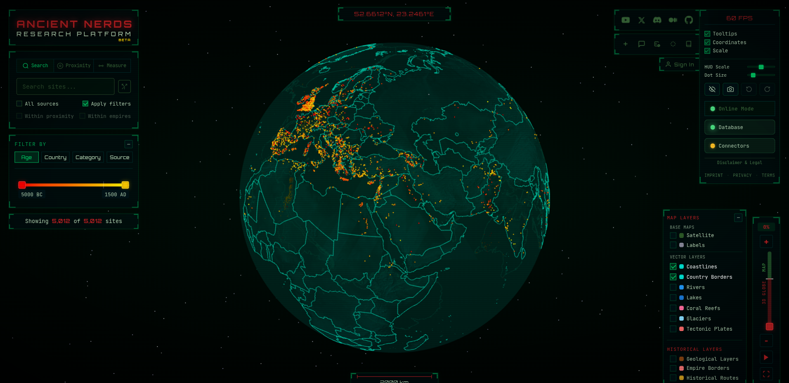

# Getting started and interface overview

[← Guide contents](README.md)

The globe combines a 3D planetary view, site markers, research filters, historical overlays, and linked site records. The initial display may contain only the primary Ancient Nerds dataset; other sources can be loaded or selected from the source filter.

## Interface regions

| Region | Purpose |
| --- | --- |
| Upper left | Search, proximity, measurement, and primary filters |
| Globe centre | Rotate, zoom, select sites, inspect overlays, and set geographic points |
| Top centre | Coordinates at the current pointer or view position, when enabled |
| Upper right | Social/navigation links, display settings, data status, and legal information |
| Lower right | Base maps, vector layers, historical layers, and zoom controls |
| Bottom centre | Scale bar, when enabled |

Panels with a **−** button can be minimized. Floating historical-layer and site-record windows can be moved, resized, minimized, maximized, or closed where the relevant window controls are shown.

## Navigate the globe

- Drag to rotate the globe.
- Use the mouse wheel or trackpad to zoom.
- Use **+**, **−**, or the vertical zoom slider on the right for precise zoom changes.
- At close zoom levels the display transitions from the 3D globe toward a map view.
- Use **Pause/Play** beneath the zoom slider to stop or resume automatic rotation.
- Use the fullscreen button beneath it to enter or leave fullscreen mode.

Site dots represent records. Their colour meaning depends on the active **Filter By** mode:

- **Age** colours sites by date.
- **Country** colours sites by country.
- **Category** colours sites by site type.
- **Source** colours sites by contributing dataset.

Hover information appears only when **Tooltips** is enabled. Clicking a site selects it and can open its detailed record. In dense areas, zoom in to separate nearby markers.

## Display settings

The upper-right settings panel contains:

| Control | Effect |
| --- | --- |
| **Tooltips** | Shows or hides hover information |
| **Coordinates** | Shows or hides the coordinate display |
| **Scale** | Shows or hides the map scale |
| **HUD Scale** | Resizes interface panels; double-click resets it |
| **Dot Size** | Changes marker size; double-click resets it |
| Eye button | Temporarily hides the interface |
| Camera button | Opens screenshot controls |
| Undo / redo | Reverses or reapplies site-selection changes when available |
| **Online Mode / Offline Mode** | Opens the offline data manager |
| **Database** | Shows the active data connection and links to database information |
| **Connectors** | Shows the status of connected research-content services |

The FPS value reports rendering performance, not internet speed. Lower the dot size, disable unneeded layers, or reduce the browser window resolution if movement becomes slow.

## Site counts

The line beneath the filters reads **Showing _n_ of _total_ sites**.

- **Showing** is the number remaining after the current filters.
- **Total** is the number currently available to the globe, including loaded sources.
- This total is not necessarily the platform-wide catalogue count.
- Selecting an unloaded source can trigger a background load and change the total.

For reproducible research, record the date, selected sources, filter settings, and visible count with your notes or screenshot.

